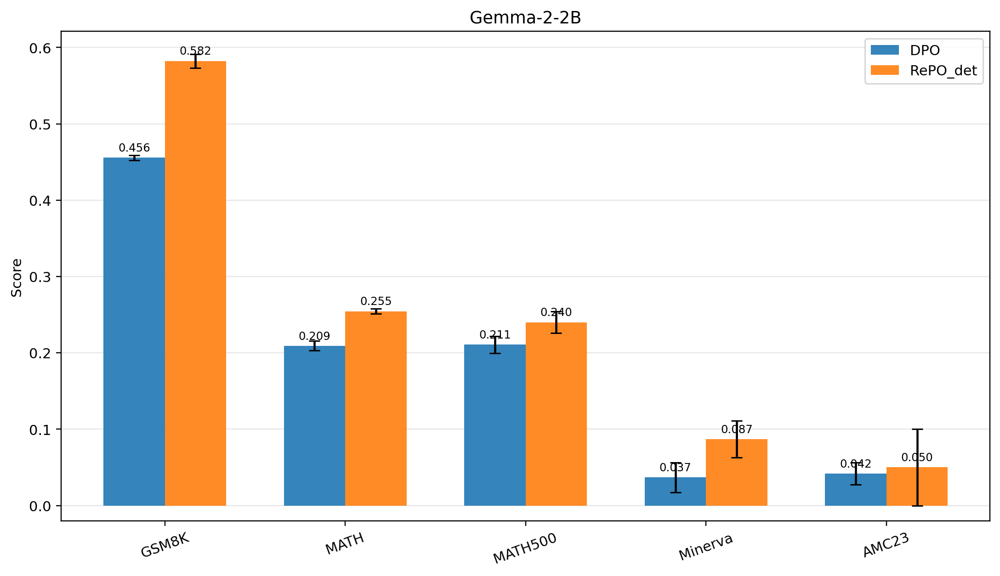
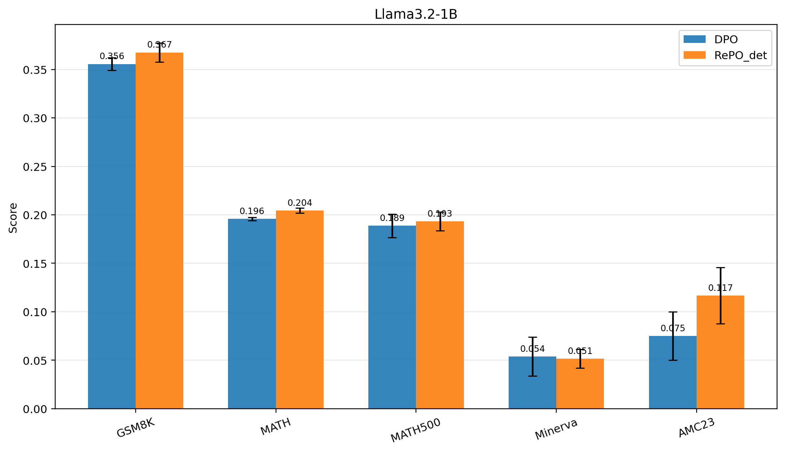
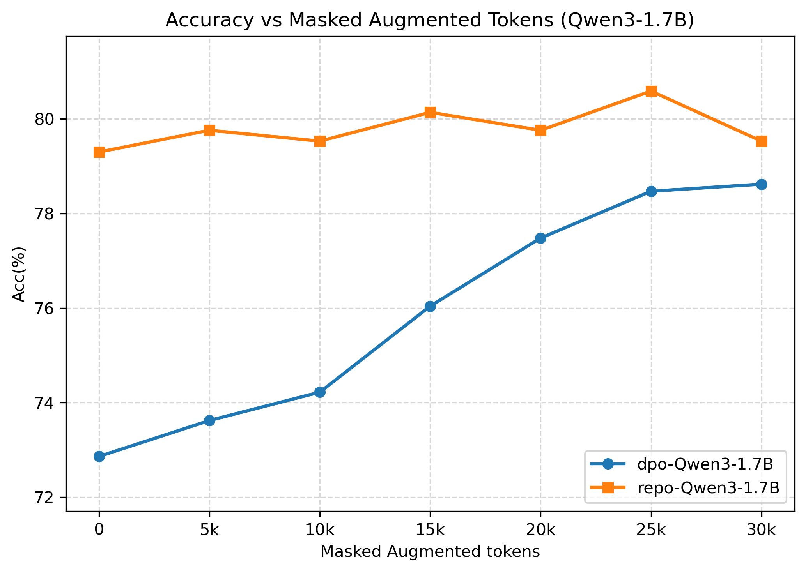
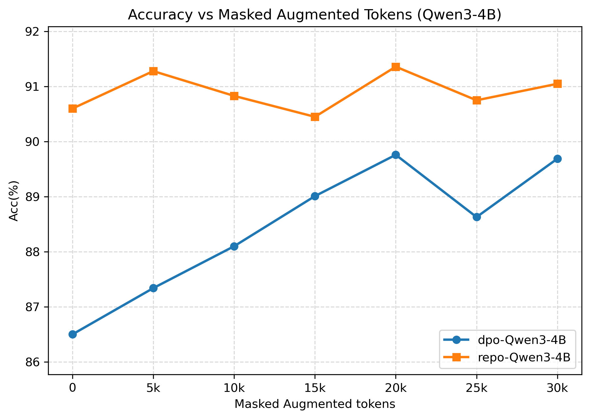

# supplementary-material-for-icml2026-RePO
supplementary material for icml2026 review

---

## Evaluation setting

**Evaluation setting.** In this supplementary material, we report results averaged over five random seeds: `41, 42, 43, 44, 45` . All evaluations are conducted with sampling-based inference using `temperature=0.7` and `top_p=0.95`. We note that the main paper uses deterministic evaluation (`temperature=0.0`); therefore, the absolute performance values and performance ranges in this supplementary may not exactly match those reported in the main paper.

---

# Table 1 - Mean ± standard deviation with 95% confidence interval

| Model | Algorithm | GSM8K | MATH | AMC23 | MATH500 | Minerva |
| ---: | ---: | ---: | ---: | ---: | ---: | ---: |
| Qwen3-1.7B | DPO | 0.7609 ± 0.0088 [0.7499, 0.7718] | 0.4892 ± 0.0036 [0.4847, 0.4937] | 0.2500 ± 0.0395 [0.2009, 0.2991] | 0.4940 ± 0.0073 [0.4849, 0.5031] | 0.1507 ± 0.0201 [0.1257, 0.1757] |
| Qwen3-1.7B | **RePO** | 0.7933 ± 0.0088 [0.7825, 0.8042] | 0.5259 ± 0.0045 [0.5203, 0.5315] | 0.3300 ± 0.0481 [0.2703, 0.3897] | 0.5320 ± 0.0102 [0.5193, 0.5447] | 0.2051 ± 0.0071 [0.1964, 0.2139] |
| Qwen3-1.7B | **RePO_det** | 0.7915 ± 0.0032 [0.7875, 0.7955] | 0.5225 ± 0.0067 [0.5141, 0.5308] | 0.3050 ± 0.0326 [0.2645, 0.3455] | 0.5284 ± 0.0131 [0.5122, 0.5446] | 0.2000 ± 0.0081 [0.1900, 0.2100] |
| Qwen3-1.7B | RPO | 0.6323 ± 0.0097 [0.6202, 0.6444] | 0.4802 ± 0.0048 [0.4742, 0.4861] | 0.2250 ± 0.0306 [0.1870, 0.2630] | 0.4796 ± 0.0173 [0.4581, 0.5011] | 0.1081 ± 0.0092 [0.0966, 0.1195] |
| Qwen3-1.7B | IPO | 0.7817 ± 0.0081 [0.7716, 0.7917] | 0.5072 ± 0.0072 [0.4982, 0.5162] | 0.2400 ± 0.0335 [0.1984, 0.2816] | 0.5184 ± 0.0146 [0.5003, 0.5365] | 0.1625 ± 0.0092 [0.1511, 0.1739] |
| Qwen3-1.7B | KTO | 0.7942 ± 0.0092 [0.7828, 0.8057] | 0.5398 ± 0.0037 [0.5352, 0.5444] | 0.3000 ± 0.0306 [0.2620, 0.3380] | 0.5464 ± 0.0070 [0.5377, 0.5551] | 0.1640 ± 0.0124 [0.1486, 0.1793] |
| Qwen3-1.7B | TDPO | 0.5903 ± 0.0077 [0.5807, 0.5999] | 0.4706 ± 0.0021 [0.4679, 0.4732] | 0.2600 ± 0.0840 [0.1557, 0.3643] | 0.4644 ± 0.0204 [0.4391, 0.4897] | 0.0993 ± 0.0130 [0.0831, 0.1154] |
| Qwen3-4B | DPO | 0.8766 ± 0.0091 [0.8653, 0.8879] | 0.5631 ± 0.0023 [0.5602, 0.5659] | 0.3550 ± 0.0570 [0.2842, 0.4258] | 0.5720 ± 0.0183 [0.5493, 0.5947] | 0.2456 ± 0.0152 [0.2267, 0.2645] |
| Qwen3-4B | **RePO** | 0.8937 ± 0.0018 [0.8915, 0.8960] | 0.6382 ± 0.0043 [0.6328, 0.6436] | 0.3800 ± 0.0855 [0.2738, 0.4862] | 0.6364 ± 0.0130 [0.6203, 0.6525] | 0.2169 ± 0.0104 [0.2040, 0.2298] |
| Qwen3-4B | **RePO_det** | 0.8949 ± 0.0057 [0.8878, 0.9020] | 0.6395 ± 0.0055 [0.6326, 0.6463] | 0.4500 ± 0.0771 [0.3543, 0.5457] | 0.6368 ± 0.0201 [0.6119, 0.6617] | 0.2140 ± 0.0136 [0.1971, 0.2309] |
| Qwen3-4B | RPO | 0.7939 ± 0.0066 [0.7858, 0.8021] | 0.6054 ± 0.0042 [0.6002, 0.6106] | 0.4150 ± 0.0418 [0.3631, 0.4669] | 0.6100 ± 0.0276 [0.5757, 0.6443] | 0.1934 ± 0.0172 [0.1721, 0.2147] |
| Qwen3-4B | IPO | 0.7783 ± 0.0117 [0.7638, 0.7929] | 0.5960 ± 0.0067 [0.5877, 0.6044] | 0.3500 ± 0.0500 [0.2879, 0.4121] | 0.5992 ± 0.0152 [0.5803, 0.6181] | 0.1750 ± 0.0172 [0.1537, 0.1963] |
| Qwen3-4B | KTO | 0.9174 ± 0.0027 [0.9140, 0.9207] | 0.6669 ± 0.0027 [0.6635, 0.6703] | 0.4350 ± 0.0675 [0.3511, 0.5189] | 0.6672 ± 0.0058 [0.6600, 0.6744] | 0.2676 ± 0.0131 [0.2514, 0.2839] |
| Qwen3-4B | TDPO | 0.8808 ± 0.0066 [0.8726, 0.8891] | 0.5920 ± 0.0019 [0.5896, 0.5944] | 0.4200 ± 0.0326 [0.3795, 0.4605] | 0.6068 ± 0.0119 [0.5920, 0.6216] | 0.2228 ± 0.0124 [0.2075, 0.2381] |

**Note.** Each entry is reported as the **mean ± standard deviation** over five random seeds, and the value in brackets indicates the **95% confidence interval**.

# Table 2 - Various Models

| Backbone | Method | GSM8K | MATH | MATH500 | Minerva | AMC23 |
|---|---:|---:|---:|---:|---:|---:|
| Gemma-2-2b-it | DPO | 0.4556 ± 0.0033 [0.4474, 0.4639] | 0.2092 ± 0.0064 [0.1933, 0.2251] | 0.2107 ± 0.0110 [0.1833, 0.2380] | 0.0368 ± 0.0195 [-0.0116, 0.0851] | 0.0417 ± 0.0144 [0.0058, 0.0775] |
| Gemma-2-2b-it | **RePO_det** | **0.5823 ± 0.0091** [0.5597, 0.6049] | **0.2545 ± 0.0031** [0.2468, 0.2622] | **0.2400 ± 0.0140** [0.2052, 0.2748] | **0.0870 ± 0.0239** [0.0276, 0.1464] | **0.0500 ± 0.0500** [-0.0742, 0.1742] |
| Llama3.2-1B-Instruct | DPO | 0.3556 ± 0.0065 [0.3395, 0.3717] | 0.1958 ± 0.0017 [0.1916, 0.2000] | 0.1887 ± 0.0121 [0.1587, 0.2186] | **0.0539 ± 0.0202** [0.0036, 0.1042] | 0.0750 ± 0.0250 [0.0129, 0.1371] |
| Llama3.2-1B-Instruct | **RePO_det** | **0.3675 ± 0.0098** [0.3432, 0.3917] | **0.2045 ± 0.0026** [0.1980, 0.2109] | **0.1933 ± 0.0095** [0.1699, 0.2168] | 0.0515 ± 0.0097 [0.0273, 0.0756] | **0.1167 ± 0.0289** [0.0450, 0.1884] |

**Note.** Each entry is reported as the **mean ± standard deviation** over five random seeds, and the value in brackets indicates the **95% confidence interval**.

### Visualization

<table width="100%">
  <tr>
    <td align="center" width="50%">
       
      Gemma-2-2B
    </td>
    <td align="center" width="50%">
       
      Llama3.2-1B-Inst.
    </td>
  </tr>
</table>

**Figure.** Comparison between DPO and RePO_det across backbones and benchmarks. Points indicate mean performance, and error bars denote 95% confidence intervals over seeds.

# Ablation study - Masked-augmented

| Augmented tokens | 0 | 5k | 10k | 15k | 20k | 25k | 30k |
|--- |---:|---:|---:|---:|---:|---:|---:|
| dpo-1.7B  | 72.86 | 73.62 | 74.22 | 76.04 | 77.48 | 78.47 | 78.62 |
| repo-1.7B | 79.30 | 79.76 | 79.53 | 80.14 | 79.76 | 80.59 | 79.53 |
| dpo-4B  | 86.50 | 87.34 | 88.10 | 89.01 | 89.76 | 88.63 | 89.69 |
| repo-4B | 90.60 | 91.28 | 90.83 | 90.45 | 91.36 | 90.75 | 91.05 |

## Visualization
<table width="100%">
  <tr>
    <td align="center" width="50%">
       
      Qwen3-1.7B
    </td>
    <td align="center" width="50%">
       
      Qwen3-4B
    </td>
  </tr>
</table>

